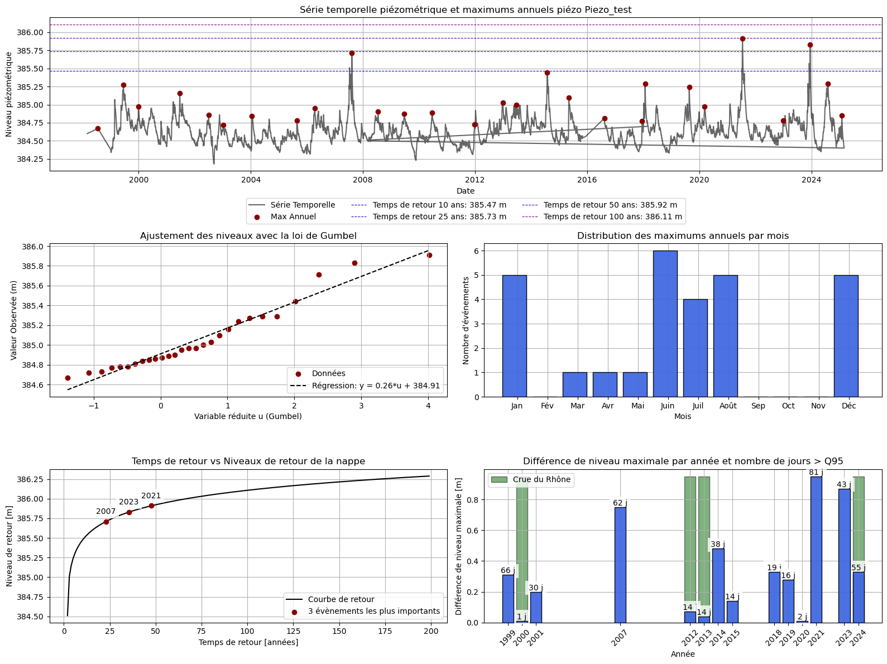

# 🌊 HydroPiezo_return_analysis
**Automated groundwater level and return period analysis**

HydroPiezo is a Python toolkit for analyzing piezometric (groundwater level) time series, identifying annual maxima, estimating extreme values using the Gumbel distribution, and generating descriptive summary sheets combining time series plots, hydrological statistics, and geospatial map context.

---

## 📘 Features

- 📈 **Time series analysis** of groundwater levels (piezometers)
- 🔺 **Detection of annual maxima** and computation of extreme events
- ⚙️ **Gumbel law fitting** to estimate return levels and periods
- 🗺️ **Integration of location maps** for each station
- 📊 **Generation of descriptive sheets** (multi-plot figures)
- 💾 **Automatic export** to high-quality PNG or PDF reports

---

## 🧮 Methods

The analysis follows standard hydrological frequency analysis steps:

1. **Data preparation**  
   - Cleaning and structuring of groundwater level measurements  
   - Extraction of yearly maxima  

2. **Extreme value analysis**  
   - Gumbel distribution fitting (`y = a*u + b`)  
   - Calculation of return levels for 10, 25, 50, 100-year return periods  

3. **Visualization**  
   - Time series with annotated extreme events  
   - Gumbel regression and monthly distribution of maxima  
   - Return level curve vs. period  
   - Interannual variability (max difference per year and Q95 exceedance days)  
   - Integrated **topographic map** showing piezometer location  

---

  

